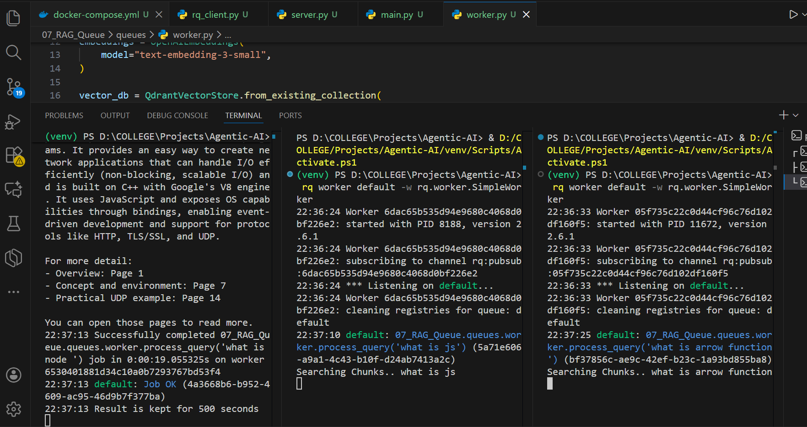

this is how we can have multiple workers.

# 07_RAG_Queue — README

A lightweight RAG (Retrieval-Augmented Generation) queue example using FastAPI + RQ + Redis + Qdrant + OpenAI embeddings.
This repo demonstrates how to enqueue user queries from a FastAPI endpoint, run background processing in RQ workers which query a Qdrant vector store for context, and then call OpenAI to answer using the retrieved context.

---

## Table of contents

* Project overview
* Repo layout
* Requirements
* Environment variables
* Local development (Windows)
* Recommended dev (WSL2 / Docker)
* Running the FastAPI server
* Running workers
* Example requests
* How results are stored & retrieved
* Scaling: multiple workers
* Troubleshooting
* Notes & best practices

---

## Project overview

* `server.py` — FastAPI app exposing:

  * `POST /chat` to enqueue a query (returns job id)
  * `GET /job-status?job_id=...` to check job status and retrieve result
* `rq_client.py` — Redis connection + `Queue` instance used by server and workers
* `worker.py` — The job processor:

  * uses LangChain `OpenAIEmbeddings` + Qdrant vector store to run `similarity_search`
  * calls the OpenAI client (chat completion) with the retrieved context and returns the answer
* Redis stores job queues and job metadata/results (RQ)
* Qdrant stores document embeddings & vector-indexed chunks

---

## Repo layout

```
07_RAG_Queue/
├─ server.py
├─ main.py
├─ queues/
│  ├─ worker.py
│  └─ rq_client.py
├─ docker-compose.yml    # optional: if you add docker-compose
├─ requirements.txt
└─ README.md
```

---

## Requirements

* Python 3.10+ recommended
* Redis server (local or remote)
* Qdrant server (local or remote)
* OpenAI API key (or relevant environment for the OpenAI client)
* Recommended packages in `requirements.txt` (example):

```
fastapi
uvicorn
rq
redis
python-dotenv
openai
langchain-openai
langchain-qdrant
qdrant-client
```

(Please pin versions in `requirements.txt` for reproducible environments.)

---

## Environment variables

Create a `.env` file at project root with at least:

```env
OPENAI_API_KEY=sk-...
OPENAI_MODEL=gpt-5-nano
EMBEDDING_MODEL=text-embedding-3-small
QDRANT_URL=http://localhost:6333
QDRANT_COLLECTION=learning_rag
REDIS_HOST=localhost
REDIS_PORT=6379
```

`load_dotenv()` is used in the code to load these variables.

---

## Local development on Windows (quick)

> Windows does not support `os.fork()`. RQ's default worker forks worker processes — that will fail on Windows. Use `SimpleWorker` for local Windows development, or run the worker inside WSL2 / Docker for full fork semantics.

1. Create & activate venv:

```powershell
python -m venv venv
venv\Scripts\Activate.ps1   # or .\venv\Scripts\activate
pip install -r requirements.txt
```

2. Ensure Redis and Qdrant are running:

* Install and run Redis locally (or use a Docker image).
* Install and run Qdrant locally `docker run -p 6333:6333 qdrant/qdrant`.

3. Start the FastAPI server:

```powershell
# using main.py (binds to localhost)
python main.py
# or using uvicorn directly:
uvicorn server:app --host 127.0.0.1 --port 8000 --reload
```

4. Start an RQ SimpleWorker (Windows):

```powershell
# CLI: run jobs in-process (no fork)
rq worker default -w rq.worker.SimpleWorker
# If you want scheduler in-process:
rq worker default -w rq.worker.SimpleWorker --with-scheduler
```

---

## Recommended: run workers in WSL2 or Docker (best)

To get full process isolation and `fork()` support (recommended for parity with Linux production):

### WSL2

* Install WSL2 + Ubuntu, install Python, Redis (or connect to host Redis), and run:

```bash
# inside WSL
pip install -r requirements.txt
rq worker default --with-scheduler
```

### Docker (example)

Add a `docker-compose.yml` to run Redis, Qdrant, and your worker & server containers. Example snippet:

```yaml
version: "3.8"
services:
  redis:
    image: redis:7
    ports:
      - "6379:6379"

  qdrant:
    image: qdrant/qdrant
    ports:
      - "6333:6333"

  server:
    build: .
    command: uvicorn server:app --host 0.0.0.0 --port 8000 --reload
    ports:
      - "8000:8000"
    depends_on:
      - redis
      - qdrant

  worker:
    build: .
    command: rq worker default --with-scheduler
    depends_on:
      - redis
      - qdrant
```

`docker compose up` will start all pieces in Linux and the RQ worker will support forking.

---

## API Usage (examples)

**Enqueue a query**

```http
POST http://127.0.0.1:8000/chat?query=what%20is%20arrow%20function%20in%20js
```

Response:

```json
{
  "status": "Queued",
  "job_id": "5a71e606-..."
}
```

**Check job status / get result**

```http
GET http://127.0.0.1:8000/job-status?job_id=5a71e606-...
```

Sample responses:

```json
// queued/started
{ "status": "queued" }

// finished
{ "status": "finished", "result": "Answer text here..." }

// failed
{ "status": "failed", "exc": "Traceback ..." }
```

> Note: your server currently uses `queue.fetch_job(job_id)` then returns `job.result` or similar. Use `job.get_status()` or `job.is_finished` checks to avoid returning results before they are ready.

---

## How the worker dequeues and executes jobs (summary)

1. `server.py` calls `queue.enqueue(process_query, query)` which writes a job id and job metadata/payload to Redis and pushes the job id into the queue list.
2. The RQ worker(s) poll Redis (blocking pop) for new job ids, pop an id, and claim the job.
3. Worker deserializes the job (imports the callable or unpickles), executes the function: `process_query(query)`.
4. The result (or exception) is written into the job hash stored in Redis. Job status is updated (`finished` / `failed`).
5. Any client can read job status & result from Redis using the job id.

---

## Scaling: multiple workers (parallelism & throughput)

You can run **multiple workers** to increase throughput and lower latency for queued jobs:

* **Run multiple worker processes on the same machine**:

  * Start multiple terminals and run:

    ```bash
    rq worker default
    rq worker default
    ```
  * Each worker will compete for jobs from the `default` queue; Redis/RQ ensures each job is handled by only one worker.
* **Run workers across multiple machines / containers**:

  * Point all workers to the same Redis host & same queue names.
  * This allows horizontal scaling — add more workers when job load increases.
* **Queue partitioning**:

  * You can create multiple named queues (e.g., `high`, `default`, `low`) and run different numbers of workers per queue to prioritize work.
* **Concurrency considerations**:

  * If you use `SimpleWorker`, jobs run in-process — running many SimpleWorkers on a single machine is still limited by CPU/RAM.
  * Forked workers (Linux) allow isolation; use them in production.
* **Auto-scaling**:

  * In cloud/deployment, use container orchestrators (Kubernetes, ECS) to scale worker replicas based on queue depth / metrics.

---

## Troubleshooting & FAQs

**Q: `0.0.0.0` not reachable in browser**
A: `0.0.0.0` is a bind address. Use `http://127.0.0.1:8000` or `http://localhost:8000` in the browser.

**Q: `AttributeError: module 'os' has no attribute 'fork'`**
A: You're on Windows. Use `rq.worker.SimpleWorker` (development) or run workers in WSL2/Docker for fork support.

**Q: Worker doesn't pick up jobs**

* Confirm Redis host/port matches in `rq_client.py` and the worker environment.
* Check worker logs for import/unpickle errors (function cannot be deserialized). Prefer enqueuing by dotted path for cross-process reliability:

  ```python
  queue.enqueue('07_RAG_Queue.queues.worker.process_query', query)
  ```
* Confirm the worker is watching the same queue name (default `default`).

**Q: Job result is `None` or missing**

* Results are stored in Redis for `result_ttl` seconds (default: 500s in RQ). They may expire. You can change TTL when enqueueing:

  ```python
  job = queue.enqueue(process_query, query, result_ttl=3600)
  ```

---

