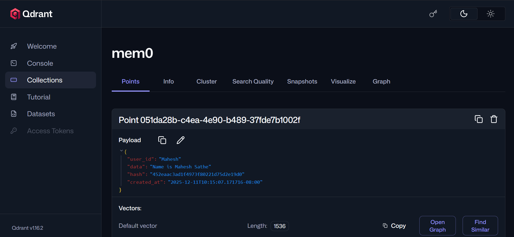
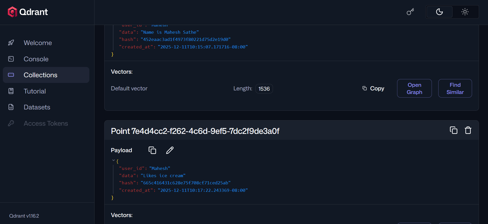

if some data about the user goes out of context window, then llm won't answer questions related to that data, to solve this we need a central store to store facts about the user, we create a knowledge graph and store that in central store.

Types of memory:
1. short term memory(STM) - remains for particular session
    ex - while you are in session, while the task is getting performed
2. long term memory(LTM) - stored forever even if session is over
    ex - your name, your age, preferences
    type of LTM:
    i. Factual Memory - facts about the user
    ii. episodic memory - memory about the past conversations with user
    iii. Semantic Memory - general memory 

STM: an ongoing conversation history is a STM ex- order chatbot
also remembers previous messgaes in session.

LTM - can be store in a db like mongodb, qdrant, graph, etc which will act like a central memory.
LTM is a growing memory so what to retrieve from LTM, thats the reason LTM is divided into Factual Memory, Episodic memory and semantic memory

i. Factual memory - facts about user like name, age, this is something always there in context.
ii. episodic memory - remembers specific past interactions or outcomes. it is on demand means if user requires something => fetch from db  => fetch from vector embeddings => and feed it as a context.
iii. Semantic memory => general knowledge ex - delhi is the capital of india.

this is how data is getting saved:

1st sentence I like icecream
2nd sentence i don't like icecream

So, what happened after 2nd sentence memory got delete which state i like icecream.