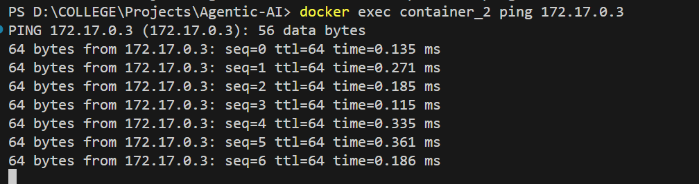

to keep same codebase, packages across all the team, environment we need some kind of solution:
1. Virtualization: takes to much memory, heavy.
Levels: heavier
OS's (full OS)
Hypervisor (heavy)
windows kernel
hardware

2. Docker: it is lightweight, as it uses local systems kernel, not using full blown OS
Levels: lighter
OS(slice of os) known as images/image (as per actual os)
Docker Engine
window kernel
harware

Docker:
1. Difference between Docker container and Docker images/images:
=> docker container is an isolated environment to run docker images/image.

commands:
1. docker run -it {images/image} => will create and run a container with provided images/image. -i(--interactive - keep STDIN(standard input) open even if not attached), -t(--tty :Allocate a pseudo tty means i wanted my systems terminal connected with Docker Engine's terminal)
- first time it will check in your system if not found pull it from docker up and next time it directly uses the same images/image but for another container.
Note: `docker run -it --name my-container ubuntu` => creates container with name my-container
      `docker run -itd --name my-container --rm ubuntu` => this will run container in detached mode with name my-container and --rm will remove the container once it is stopped 
2. docker ps => lists all running the container
3. docker ps -a => lists all the containers (running/not running all), alias(docker container ls, docker container pd, docker container list)
4. docker images/images => list all the images/images have on machine, same as docker images/image ls
5. docker version
6. docker info => all the information of docker engine
7. docker pull images/image-name => manually pulling images/images for future purpose from docker-hub, docker images/image pull images/image-name
8. docker images/image inspect images/image-name => all the details will come
9. docker images/image rm images/image-name => to remove any of the images/image, but first need to container using this images/image then only able to delete this images/image.
10. docker container rm containerID => to remove container.
docker rm containerid1  containerid2 container 3, can remove at one time only
11. docker kill containerId => to stop running container, but still data of that container will be there, whereas rm command will remove that container.

=> EntryPoint: every images/image has entrypoint, once you connect to images/image where to connect default entrypoint.
for ex: for ubuntu images/image default entrypoint is bash.
we can also do like, this 
docker run -it {images/imageName} {command} {args} => docker run [OPTIONS] images/image [COMMAND] [ARG...]
ex- docker run -it busybox ping google.com

=> To check default entrypoint:
docker images/image inspect {images/imageName}
response = {
    ..
    "Cmd:[
        "sh"
    ]
    ..
}

this kind of json will come which will should what will be the default command or entrypoint for a particular images/image

Creating and using a Dockerfile to containerize node.js app:
Dockerfile is basically a config file

after writing Dockerfile use below command:
docker build -t my-app .

this is inside our container

Server is running in container:

to optimize this dockerfile we are using node official images/image instead of using ubuntu and install nodejs which results in higher size of images/image

we can add default entry point when the user runs the images/image by using below command
-- this command get executed when container starts
CMD ["npm", "start"]

every commands is a layer, docker caches the layers, if we do change in 3rd command, then docker stores 1st and 2nd in cache, and rest of the command will again got executed.

if source code got changed, then this will do npm install again, this is bad, what we can do:
-- once working directly is set, no need to mention it explicitly in copy command
WORKDIR /home/app

COPY package-lock.json package-lock.json 
-- also we can use wildcard pattern for this.
COPY package.json package.json

-- doing installation in working directory
RUN npm install

COPY index.js index.js 

means it will cache above commands and only index.js

### Command to build an images/image:
`docker build -t my-app .`

### To run and images/image in container:
`docker run -it my-app`

### Port mapping:
- now if we run the docker images/image, it will run the project, but still that localhost url is not mapped to a port. this port number will be of container not of our(host) system, as these container is isolated we can't use this, without doing port mapping.

command for this:
docker run -it -p [host's port]:[container's port] images/image-name
docker run -it -p 8000:8000 my-app   # host machine = localhost:8000 
docker run -it -p 3000:8000 my-app   # host machine = localhost:3000 

we can also do multiple port mappings:
docker run -it -p 3000:8000 -p 3001:9000 -p 3002:8001 my-app

### Automatic port mapping:
Need to add below command in Dockerfile:
EXPOSE 8000

Use below command while building images/image:
docker run -it -P  my-app  

-- when we expose a port, and use -P in run command, then docker will randomly assign a port to exposed ports.

for multiple ports:
EXPOSE 8000 3000 4000

docker run -it -P  my-app

to expose ports in a range:
EXPOSE 8000-8009

### after stoping a container it will remain in docker engine, to remove such container when they are stopped use below command:
docker run -it -P --rm my-app

### detached mode: to use one terminal and docker run command is blocking from executing other commands on that single terminal, then use:
docker run -it my-app -d # -d for running container in background and it will print container id.

### To push images/image on docker hub
- create repository on docker hub
- do docker build with the same name
- do docker login
- do docker push (buildname)repository name
  ex - `docker push mbs07/node-application` 

if build is of different name then:
- docker tag {build name} {repositoryname}
  ex - `docker tag my-app mbs07/node-application`

to push to version specific thing:
ex- `docker tag my-app mbs07/node-application:v1`
    `docker push mbs07/node-application:v1`

- if wants to pull specific version then use: `docker pull mbs07/node-application:v1`

### Building Optimized Multi-Stage Docker images/images for Production Use:
- now when we build a typescript project dist folder got created containing all the source code files, then why we are Copying source code from src folder too, the reason is if i build the project on windows and copy only the build folder means (dist folder), the same build might not work on linux or mac systems. To solve this we can use multi stage builds

in Multi stage docker images/images:
- create 1st stage to build the code as build and in 2nd stage only taking the build folder into images/image

=> cmd to use dockerfile by filename:
`docker build -t ts-app-old -f Dockerfile.old .`

- look at the size difference of old and new images/images: old = 251 MB and new = 197 MB

- here if we run a container for new ts-app there is not source code folder:

EX => Project => stage 1 (will give 1 GB (binary-exe file))  do the installation, copy the source code,                                    build the source code => => stage 2 (will give binary-exe file and start binary file) - Real world will get this only binary file, which will be in smaller size => world will use stage 2 lightweight

in final stage, there will no languages related libraries, no source code, just binary executable file

### Security vurnalability:
- user who is starting the docker file has admin previliges he can delete the files can do anything, you should never run the final command as a admin, so you can actually create the users in docker images/image
use below lines before CMD : 

RUN addgroup --system --gid 1001 nodejs
RUN adduser --system --uid 1001 nodejs

USER nodejs

- this will run as nodejs user which has no admin previliges, always run the final as a non root user, if you run as a root user there might be some security vurnalabilities.

### Adding env port:
EXPOSE 3000
ENV PORT=3000 # make sure this line is added in docker file while building images/image

- below command will assign enviroment port number to the server:
- inside code we have => 
`const PORT = process.env.PORT ? +process.env.PORT : 3000;` 
- this line will take port number from env, but as of now we don't have any port in env, so in docker command we can pass env port using below command
`docker run -it -p 8000:8000 -e PORT=8000 ts-app-new`

- We can also add multiple env variables:
`docker run -it -p 8000:8000 -e x=y -e w=v -e t=u images/image-name`

- if we have env file then we can use below command: this will load env variables
`docker run -it -p 3000:3000 --envfile=./.env images/image-name`

### Networking:
- container networking refers to the ability for containers to connect to and communicate with each other, or to non-Docker workloads
- containers have networking enabled by default, and they can make outgoing connections.
- a container has no information about what kind of network its attached to or whether their peers are also Docker workloads or not.
- a container only sees a network interface with an IP address, a gateway, a routing table, DNS services, and other networking details.

- commands: `docker network` - this will list all the related commands
- `docker network ls` - will list all the networks

Docker's networking subsystem is pluggable, using drivers. Several drivers exist by default and provide core networking functionality:
i. Bridge: the default network driver, if you don't specify a driver, this is the type of network you are creating.

host(default driver which is connected to wifi router) => docker (create a network interface called bridge) => a new docker container => docker engine connected new container with the bridge thereby this container has its own subnet, own IP, etc.. this is how docker container can access internet.

`docker network inspect bridge`:
{
  ....
  "Containers": {
            "6ade0cde1ec3e845aa57fe22764dda3a34696b83e823fab4acf374ea4deb336d": {
                "Name": "container_2",
                "EndpointID": "e57d54eabfeae8667a55c190bc500e8a34b3d92586dd07c30cefdbdcbba5f97d",     
                "MacAddress": "e2:c8:52:e6:c0:4f",
                "IPv4Address": "172.17.0.3/16",
                "IPv6Address": ""
            },
            "a2ea9799e6abe99d3280138d331510b1163079f743cd019ee9e459c4b365669d": {
                "Name": "my-container",
                "EndpointID": "03e5df24f85863533007c7eb47441136a409dda84952895d23075b081c4cb3c0",     
                "MacAddress": "82:99:49:42:e2:be",
                "IPv4Address": "172.17.0.2/16",
                "IPv6Address": ""
            }
        },
  ...
}
in this way bridge has ips and other details separately for each containers.
both are connected to same bridge means same network but has different IPs.

- now ping one container from other:
`docker exec container_2 ping 172.17.0.3 `

- similarly we can have multiple containers communicating with each other.
- all the containers will be in same network.
- why all the containers in same networks: because machines in the same network can communicate privately, there is no need to have public IP addresse of these machines, there is no need to expose.
ex - we have one container have node js source code, one container of redis and other container of postgres for db, these all 3 can communicate privately as they are in same network. This is nodejs machine can be make public for peoples use, but these internal machines can be kept hidden from external world.

- Bridge networks are commonly used when your application runs in a container that needs to communicate with other containers on the same host.

- in terms of networking, a bridge network is a link layer device which forwards traffic between network segments. Whereas in terms of docker, a bridge network uses a software bridge which lets containers connected to the same bridge network communicate, while providing isolation from containers that aren't connected to that bridge network.

- types of bridge network:
i. default bridge network => when you start docker, a default bridge network(also called bridge) is created automatically, and newly started containers connect to it unless otherwise specified.
ii. user defined bridge network => 
- superior to default bridge network.
- user defined bridges provides automatic DNS resolution between containers :
i. containers on default bridge network can only access each other by IP addresses, unless you use --link option, which is considered legacy. On a user-defined bridge network, containers can resolve each other by name or alias. 
imagine an application with a web front-end and a database backend. if you call your containers web and db, the web container can connect to the db container at db, no matter which docker host the application stack is running on.
- user defined bridges provides better isolation
- containers can be attached and detached from user-defined networks on the fly.
- each user-defined network creates a configurable bridge.

### Create your own bridge network:
- command
`docker network create [Options] network-name`
ex -  `docker network create milkyway` = this is user defined network
- assign network to a container:
`docker run -itd --network=milkyway --rm --name=spiderman busybox` 
-- we have created below containers using milkyway networks: 
spiderman => IP = 172.24.0.2
ironman => IP = 172.24.0.3
dr => IP = 172.24.0.4

- can we ping container_2 which has default bridge networks from spiderman container which is in user defined network:
=> as they are in isolated environment they cannot talk to each other.

- Can containers in user defined network communicate without giving IPs?
=> Yes, as user-defined network as Automatic DNS resolution between the containers so it is possible.

- on the fly can attach and detach the containers:
1. attaching container to the network:
`docker network connect milkyway container_2`

- `docker network inspect milkyway`:
{
  "Containers": {
            "2aa830d2d1bfb3562d4ebe9ca2cfa4b906d734063d38559d1dfad179c4a17f3c": {
                "Name": "spiderman",
                "EndpointID": "7ab04165df25dd3870b1ca849f0de253d1319d129713f0918a979dde75dfdc61",     
                "MacAddress": "f2:46:1a:9c:5e:40",
                "IPv4Address": "172.24.0.2/16",
                "IPv6Address": ""
            },
            "6ade0cde1ec3e845aa57fe22764dda3a34696b83e823fab4acf374ea4deb336d": {
                "Name": "container_2",
                "EndpointID": "2bf347b894f7f5f53061e2d19e4f7463148bc8cc0a15b0685355d0f5ff29e4a6",     
                "MacAddress": "7e:bb:cc:66:ff:19",
                "IPv4Address": "172.24.0.5/16",
                "IPv6Address": ""
            },
            "964d4beccc61af1ab8887ba42a42ccdae8a6c6ea94061d35f98c58ba4df935cb": {
                "Name": "dr",
                "EndpointID": "d475c18d919e2f4c45e94ad38c361356a68102bb6c86e915f9270b3ec3106c67",     
                "MacAddress": "3e:4e:af:52:a0:42",
                "IPv4Address": "172.24.0.4/16",
                "IPv6Address": ""
            },
            "a9d21d8341de371f88419abf742892880adb7dc31c643bd6a8d67d40868696c1": {
                "Name": "ironman",
                "EndpointID": "ba8b8bfbf5411f02fcabdbce1f79e747a9ec0ac2bf758f6e246a2083e34f3b2d",     
                "MacAddress": "02:83:28:eb:68:d9",
                "IPv4Address": "172.24.0.3/16",
                "IPv6Address": ""
            }
        },
}

2. detach a container from network:
`docker network disconnect milkyway dr`